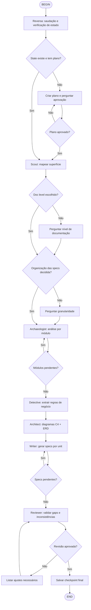

# Reversa Flow — Pipeline Automatizado

Execute o pipeline completo de engenharia reversa seguindo o diagrama abaixo.

## Instruções por nó

### A → B: Reversa
Leia `.reversa/state.json`. Se não existir, execute o passo de primeira execução (coletar nome, idioma, criar plano).

### B → C: Verificação de estado
Se `phase` for `null`, o projeto ainda não começou. Pergunte aprovação do plano.

### C → D: Criar plano
Analise a estrutura de pastas raiz, identifique módulos principais e crie `.reversa/plan.md`.

### D → E: Aprovação
Apresente o plano e pergunte: "O plano está aprovado?" Se não, ajuste.

### F: Scout
Ative `reversa-scout`. Gere `inventory.md`, `dependencies.md` e `surface.json`.

### G → H: Nível de documentação
Se `doc_level` não estiver definido, apresente as 3 opções (Essencial, Completo, Detalhado) e salve a resposta.

### I → J: Organização das specs
Se `[specs]` do `config.toml` estiver vazio, apresente as 6 opções de granularidade e salve.

### K: Archaeologist
Para cada módulo em `surface.json.modules`, ative `reversa-archaeologist`. Salve checkpoint após cada módulo.

### L: Loop de módulos
Continue até `modules_pending` estar vazio.

### M: Detective
Ative `reversa-detective`. Gere regras de negócio, state machines, permissões.

### N: Architect
Ative `reversa-architect`. Gere C4 diagrams, ERD, mapa de integração.

### O: Writer
Para cada unit definida em `[specs]`, ative `reversa-writer`. Gere `requirements.md`, `design.md`, `tasks.md`.

### P: Loop de specs
Continue até todas as units estarem geradas.

### Q: Reviewer
Ative `reversa-reviewer`. Valide gaps, inconsistências e matriz de rastreabilidade.

### R → S: Ajustes
Se o Reviewer encontrar problemas, liste-os e retorne ao Writer ou Detective conforme necessário.

### T: Checkpoint final
Salve `.reversa/state.json` com `phase: null` e `completed: [todas as fases]`.

## Regra não-negociável
Nunca apague, modifique ou sobrescreva arquivos pré-existentes do projeto legado.
O Reversa escreve **apenas** em `.reversa/` e `_reversa_sdd/`.
